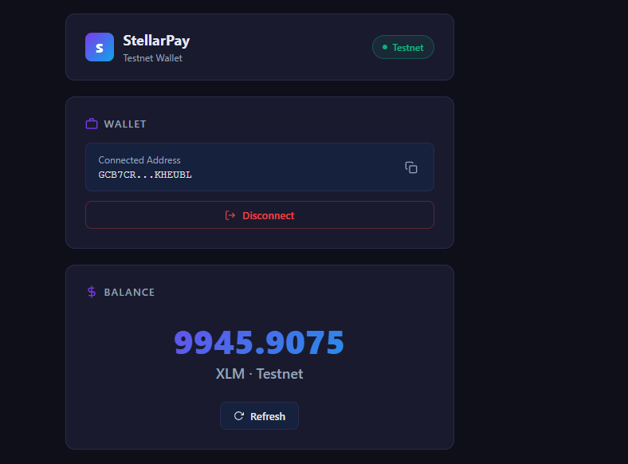
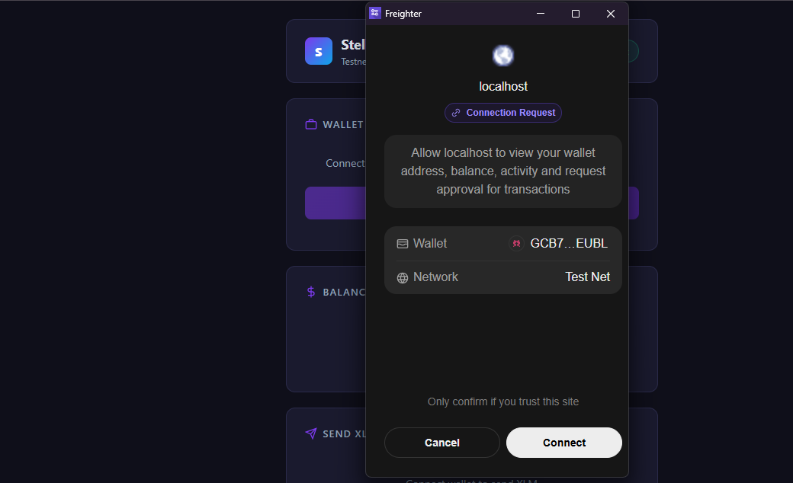
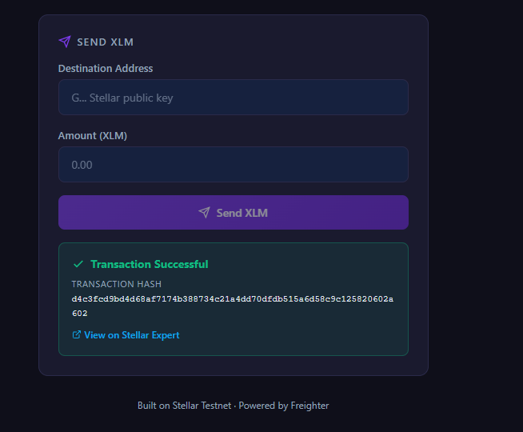
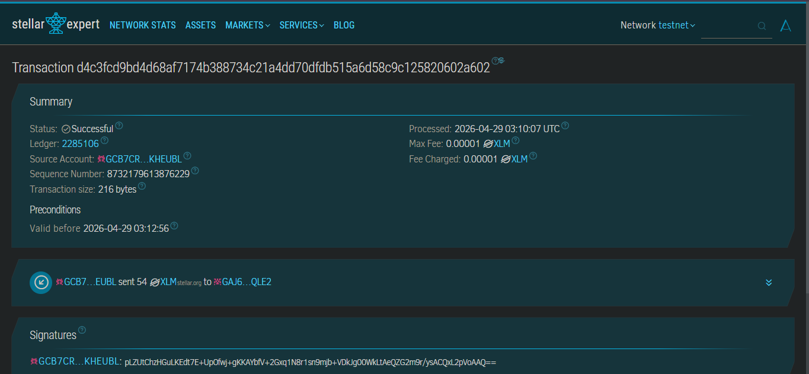

# StellarPay — Stellar Testnet Wallet

A clean, minimal Stellar dApp built on Testnet for the **Stellar Journey to Mastery — White Belt** challenge.

Built with React + Vite, it lets users connect their Freighter wallet, view their XLM balance, and send XLM transactions on the Stellar Testnet — with real-time feedback and a direct link to the transaction on StellarExpert.

---

## Live Transaction Proof

**Transaction Hash:**
[d4c3fcd9bd4d68af7174b388734c21a4dd70dfdb515a6d58c9c125820602a602](https://stellar.expert/explorer/testnet/tx/d4c3fcd9bd4d68af7174b388734c21a4dd70dfdb515a6d58c9c125820602a602)

| Field | Value |
|---|---|
| Status | Successful |
| Ledger | 2285106 |
| From | GCB7CR...KHEUBL |
| To | GAJ6...QLE2 |
| Amount | 54 XLM |
| Fee Charged | 0.00001 XLM |
| Processed | 2026-04-29 03:10:07 UTC |
| Network | Stellar Testnet |

---

## Features

- Connect and disconnect Freighter wallet
- Display live XLM balance from Stellar Testnet
- Send XLM transactions on Testnet
- Success state shows transaction hash with link to StellarExpert
- Error handling with Horizon result codes
- Friendbot link for unfunded accounts

---

## Tech Stack

| Tool | Purpose |
|---|---|
| React + Vite | Frontend framework |
| @stellar/freighter-api | Wallet connection & transaction signing |
| @stellar/stellar-sdk | Transaction building & Horizon API |
| Stellar Testnet | Network |
| StellarExpert | Transaction explorer |

---

## Setup Instructions

### Prerequisites

- Node.js v18+
- [Freighter Wallet](https://freighter.app/) browser extension
- Freighter set to **Testnet**: Settings → Network → Test SDF Network

### Run Locally

```bash
git clone https://github.com/Alouzious/stellar-wallet.git
cd stellar-wallet
npm install
npm run dev
```

Open [http://localhost:5173](http://localhost:5173)

### Fund Your Testnet Account

If your account shows "not found", fund it:

```
https://friendbot.stellar.org?addr=YOUR_PUBLIC_KEY
```

Or click the **Fund with Friendbot** link shown directly in the app.

---

## Screenshots

### Wallet Connected + Balance




### Successful Transaction  with Hash


### Transaction Result on Stellar Expert


---

## Project Structure

```
src/
├── components/
│   ├── WalletConnect.jsx   # connect/disconnect Freighter
│   ├── Balance.jsx         # fetch and display XLM balance
│   └── SendPayment.jsx     # send XLM form + tx feedback
├── App.jsx
└── index.css
```

---

## Resources

- [Stellar Testnet Explorer — StellarExpert](https://stellar.expert/explorer/testnet)
- [Stellar Network Stats](https://stellar.expert/explorer/testnet/network-activity)
- [Freighter Wallet](https://freighter.app/)
- [Stellar Horizon Testnet](https://horizon-testnet.stellar.org)
- [Stellar Friendbot](https://friendbot.stellar.org)

---

## License

MIT
